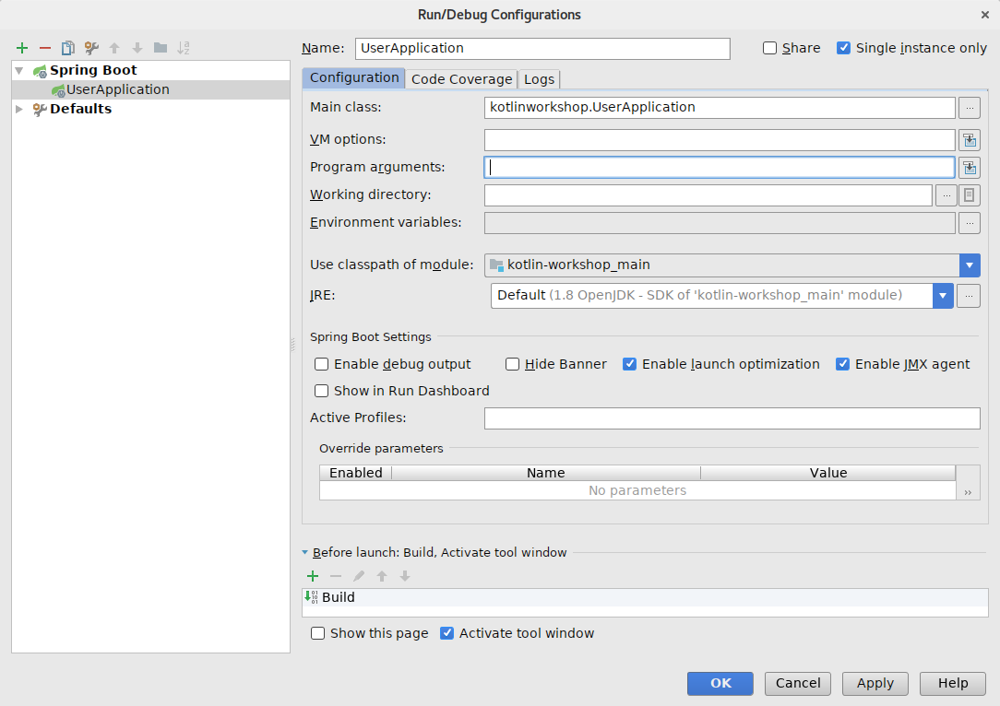

# Kotlin Workshop

# Requirements

- Docker and Docker-Compose (for the MySQL container). Or you can manage your local MySQL database manually.
- Java 8 JDK
- IntelliJ IDEA (highly recommended). You won't have much fun with Eclipse.
    - IntelliJ IDEA 2017.2.2 or newer. The Community Edition is fine.
    - Latest Kotlin Plugin 

# Preparation

## Clone Project

Please clone the correct branch (`starting-point`). **Don't look at the files in `src/main/kotlin` in the master branch, because that is the solution of the workshop**. :-) 

```bash
git clone -b starting-point https://github.com/phauer/kotlin-workshop.git
```

## Open the Project in IDEA

Use `File → Open ...` and choose the folder `kotlin-workshop`.

## Start the MySQL Container

Make sure, that the port `3306` is free and not used by another mysql instance: `netstat -tulpe | grep 3306`. Alternatively, you can also set a different port by changing the files `docker-compose.yml` and `src/main/resources/application.properties`.

Run `docker-compose up`. This starts the MySQL container.

If you like to access the database with your MySQL client (like the one integrated into IDEA), you can use the following credentials: user `root`, pw `root`, database `db`, address `localhost:3306`. You can take a look at the created dummy data with `SELECT * FROM users;`.

## Start the Application

Call `docker-compose up` if you haven't already. 

A) For IDEA Ultimate Edition:

Create a Spring Boot Run Configuration. `Run > Edit Configurations...`. Click on the green Plus Icon and select `Spring Boot`. In the dialog select the Main class `kotlinworkshop.UserApplication`. Run the config.



B) For IDEA Community Edition:

Create a normal Kotlin Run Configuration. Run the class `src/main/kotlin/kotlinworkshop/UserApplication.kt` by right-clicking on the file.

Open the UI under [localhost:8080](http://localhost:8080/).

Hint: The application starts **2 seconds faster** if you use the Spring Boot Run Configuration in IntelliJ instead of the normal Kotlin Run Configuration. You can also add the relevant VM arguments `-Xverify:none -XX:TieredStopAtLevel=1` to the Kotlin Run Configuration manually.

Hint#2: You can avoid restarting the whole application by using IDEA's Hot Code Replacement. Change the source code and press `Ctrl+Shift+F9` (hot replaces only the current file) or `Ctrl+F9` (hot replaces all changes files). This works as long as you only change method bodies (not for signature changes or added fields).

## Troubleshooting for Windows and Mac Users

If you use docker-machine, you can't access the MySQL via `localhost`. You have to use the IP of the Docker VM (use `docker-machine ls`). In this case, you have to put the IP in the file `src/main/resources/application.properties`.

# The Tasks

The Vaadin UI is already ready. You only have to implement the logic and database access behind the UI controls.


- Find and display all users: click button in vaadin gui, retrieve all users from mysql, display the result in the gui. therefore, please fulfil the mapping rules specified in `local-db-init/users.sql`.
- Search for a certain user id: enter an ID in the textfield `idSearchField` and display the result in the table. mind to handle the "not found" case.
- Add a button "email of active users". when clicked, it should show a notification that shows all emails of all active users. please filter and map the data in the application layer using Kotlin's collection API.
- Delete user: add a button in the table to delete a user.
- Add a button to generate _n_ dummy users. the number of dummy users can be specified with a new text field. handle invalid inputs (empty textfield, not a number). for the sake of simplicity, insert each new user with a dedicated `INSERT` statement (no batch update required).

You should only have to touch the following files:

- Create a dedicated file for the data model.
- `UserDAO`
- `UserUI`

# Relevant API Knowledge

```kotlin
//create enums
enum class Platform { EU, NA }
```

## Spring JDBCTemplate

For the `UserDAO`:

```kotlin
//query for multiple entries and map them using the rowMapper
template.query("SELECT * FROM users;", this::mapToUser)
// mapToUser has to be a function with the signature: 
// mapToUser(rs: ResultSet, rowNum: Int): User
// within the method, you can access the cell values with methods like: rs.getString("columnName")

//query for a single object and supply an argument
template.queryForObject("SELECT * FROM users WHERE id = ?;", arrayOf(id), this::mapToUser)
//mind that an EmptyResultDataAccessException is thrown, when no object was found

//in your implementation of your RowMapper (the method mapRow(ResultSet, rowNum)), you can use
resultSet.getString("email")
//to retrieve the values of a certain column

//insert
template.update(
        "INSERT INTO users (id, email, firstname, lastname, description, guest, platform, date_created, state) VALUES (?, ?, ?, ?, ?, ?, ?, FROM_UNIXTIME(?), ?);",
        id, email, firstname, lastname, description, guest, platform, date_created, state
)
```

## Vaadin

For the `UserUI`:

```kotlin
//set items to a grid (= a table)
table.setItems(users)
// mind to change the grid object creation to: Grid<User>(User::class.java) instead of Grid<Any>

//show a notification:
Notification.show("Hi!")

//add a button to each row in the table
table.addComponentColumn{ person ->
    val button = Button(VaadinIcons.TRASH)
    button.addStyleName(ValoTheme.BUTTON_BORDERLESS)
    button.addClickListener {
        println(person)
    }
    button
}
```

# Some Useful Links

- [Kotlin Idioms](https://kotlinlang.org/docs/reference/idioms.html)
- [Idiomatic Kotlin](https://blog.philipphauer.de/idiomatic-kotlin-best-practices/)
- [Clean Code with Kotlin](https://blog.philipphauer.de/clean-code-kotlin/)
- [Kotlin Cheat Sheet](https://jaxenter.com/kotlin-cheat-sheet-tips-tricks-136716.html)
- [Kotlin Koans](https://kotlinlang.org/docs/tutorials/koans.html)

# Kotlin Features to show

Kotlin features are really nice when it comes to mapping (ORM in our case).

|Kotlin Feature|Used where?|
| ------------- |:-------------:|
|Data Classes, Immutability| User |
|Nullability, null handling means|MySQL columns can be null, No User for an ID |
|single expression functions, control structures are expressions | DAO methods | 
|collection api | filtering and mapping in application layer |
|string interpolation | firstname & lastname |
|`apply()`| group gui component initialization |
|`when` | map from different values for platform to Platform enum |